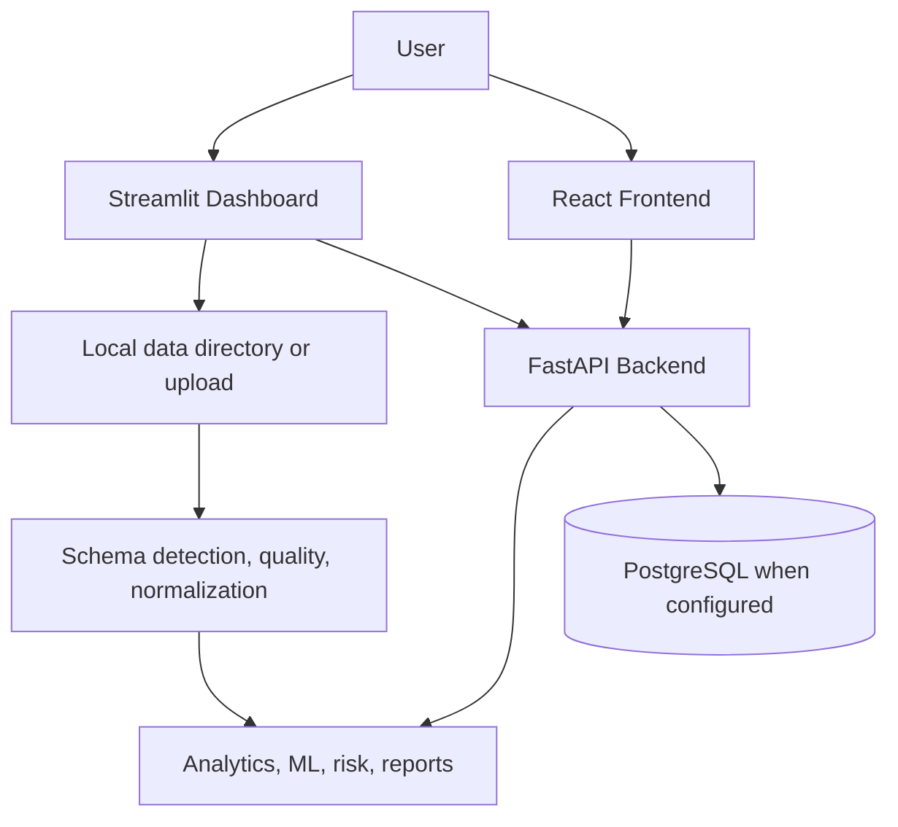

# AtmoSync

AtmoSync is a data-driven supply-chain analytics and intelligence platform combining a FastAPI backend, an automatic local-dataset Streamlit dashboard, analytics and risk engines, an IoT simulator, ML utilities, and a React frontend.

## Features

- FastAPI backend with authentication, sensor, commodity, alert, simulator, analytics, ML, and report routes
- Dataset-driven Streamlit dashboard with automatic local source discovery
- Dataset Explorer with search, column selection, filters, statistics, and filtered downloads
- Dynamic KPIs and Plotly visualizations calculated from the selected dataset
- Sales, inventory, product, commodity, supplier, location, shipment, and supply-chain analysis when compatible fields exist
- Data-quality profiling for missing values, duplicates, data types, dates, and numeric validity
- Existing commodity-aware spoilage engine integration when temperature and humidity fields exist
- Sensor monitoring and threshold alerts when sensor fields exist
- Deterministic data-backed findings, alerts, and CSV/JSON/Excel reports
- Existing loss, arbitrage, health, ML, and IoT simulator functionality
- React + Vite frontend
- Automated regression tests

## Architecture



## Repository structure

```text
AtmoSync/
├── backend/              # FastAPI app, models, schemas, routes, services
├── analytics/            # Spoilage, loss, arbitrage, health, and SCMS analytics
├── ml/                   # Dataset inspection and ML utilities
├── simulator/            # IoT telemetry simulator
├── streamlit_app/        # Dataset-driven Streamlit dashboard
├── frontend/             # React + Vite frontend
├── data/                 # Current SCMS source datasets
├── tests/                # Pytest suite
├── docs/                 # API and project documentation
├── docker/               # Docker-related files
├── requirements.txt
├── .env.example
├── .gitignore
└── README.md
```

## Dataset

The dashboard automatically discovers supported files in `D:\Atmosync\data` and selects `scms_cleaned.csv` as the primary local dataset when present. `scms_dataset.csv` is retained as the supporting/raw source. The current files are approximately 4 MB each and are tracked as project data.

The primary cleaned dataset currently contains:

- 10,324 rows
- 39 columns
- 0 duplicate rows

Important detected fields:

- Date: `Delivered to Client Date`
- Quantity: `Line Item Quantity`
- Revenue: `Line Item Value`
- Cost basis: `Freight_Cost_USD_Clean`
- Price: `Pack Price`
- Product: `Item Description`
- Commodity/category: `Product Group`
- Supplier: `Manufacturing Site`
- Location: `Country`
- Shipment: `ASN/DN #`

Verified calculations from the current cleaned dataset:

- Quantity: `189,265,090`
- Revenue: `$1,627,584,457.29`
- Freight cost: `$93,042,611.605`
- Profit basis: `$1,534,541,845.685`
- Average price: `$21.91`
- Date range: `2006-05-02` to `2015-09-14`

These values are calculated from the current file at runtime, not hardcoded application values. The production dashboard source contains no fake, Olist, or demo records.

Supported upload formats:

- CSV
- XLSX/XLS
- JSON
- Parquet

Uploaded or discovered datasets are profiled, normalized, and used for supported KPIs, charts, findings, alerts, risk analysis, and reports. Missing capabilities are reported instead of fabricated.

## Dashboard

The Streamlit navigation currently includes:

1. Dashboard
2. Dataset Upload
3. Dataset Explorer
4. Sales & Inventory
5. Product & Commodity
6. Supply Chain
7. Sensor Monitoring
8. Spoilage & Risk
9. Financial & Opportunity
10. Data Quality
11. AI Insights
12. Alerts
13. Reports
14. Live Operations

Pages show useful empty states when the selected dataset does not contain the required fields.

## Installation

```powershell
git clone https://github.com/Kunalray0707/AtmoSync.git
cd AtmoSync
python -m venv venv
.\venv\Scripts\Activate.ps1
python -m pip install --upgrade pip
python -m pip install -r requirements.txt
npm install
```

## Environment configuration

Create a local environment file from the placeholder template:

```powershell
copy .env.example .env
```

Relevant variables currently used by the project include:

- `DATABASE_URL`
- `DATABASE_URL_SYNC`
- `SECRET_KEY`
- `ALGORITHM`
- `ACCESS_TOKEN_EXPIRE_MINUTES`
- `REFRESH_TOKEN_EXPIRE_DAYS`
- `REDIS_URL`
- `KAFKA_BOOTSTRAP_SERVERS`
- `ATMOSYNC_BACKEND_URL`
- `ATMOSYNC_REQUEST_TIMEOUT`
- Optional Snowflake, Slack, SMTP, and frontend variables in `.env.example`

`.env` is ignored by Git. `.env.example` contains placeholders only. Never commit passwords, tokens, API keys, or database credentials.

## Running the backend

```powershell
cd D:\Atmosync
.\venv\Scripts\python.exe -m uvicorn backend.main:app --host 127.0.0.1 --port 8000
```

Backend URL: http://127.0.0.1:8000
API prefix: http://127.0.0.1:8000/api
OpenAPI documentation: http://127.0.0.1:8000/docs

## Running Streamlit

```powershell
cd D:\Atmosync
.\venv\Scripts\streamlit.exe run streamlit_app/app.py --server.port 8502
```

Dashboard URL: http://localhost:8502

The app automatically discovers local datasets from `D:\Atmosync\data`. If no supported file exists, it displays an onboarding message rather than fake metrics.

## Running the frontend

```powershell
cd D:\Atmosync
npm run dev
```

Production build:

```powershell
npm run build
```

## Testing

```powershell
cd D:\Atmosync
.\venv\Scripts\python.exe -m pytest -q
```

The latest verified result is:

- 28 passed
- 0 failed
- 2 warnings

Compilation check:

```powershell
.\venv\Scripts\python.exe -m py_compile streamlit_app/app.py streamlit_app/api_client.py streamlit_app/config.py streamlit_app/services/analytics.py streamlit_app/services/dataset.py
```

## Data limitations

The current SCMS dataset does not contain:

- Temperature
- Humidity
- Sensor readings
- Container IDs
- Explicit risk scores
- Spoilage fields
- Route coordinates

Therefore, sensor monitoring, spoilage/risk scoring, and arbitrage analysis report that compatible fields are unavailable for this dataset. Those features remain available when a compatible dataset is selected.

## Security

- Secrets are supplied through environment variables.
- `.env` and environment-specific files are excluded from Git.
- `.env.example` contains placeholders only.
- Virtual environments, caches, logs, build output, and Streamlit secrets are excluded.
- API keys, passwords, tokens, and database credentials must never be committed.

## GitHub

Repository: https://github.com/Kunalray0707/AtmoSync

GitHub synchronization status is verified separately after a successful push; this document does not claim that a push succeeded.

## Deployment

Streamlit Community Cloud deployment has not yet been verified.

Manual deployment steps:

1. Push the repository to GitHub.
2. Open Streamlit Community Cloud.
3. Select repository `Kunalray0707/AtmoSync` and branch `main`.
4. Set the app path to `streamlit_app/app.py`.
5. Configure only required secrets and environment variables.
6. Deploy and verify the public application.

## License

No explicit license file is currently present. Confirm the licensing choice before external redistribution or commercialization.
