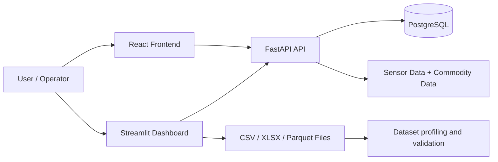

# AtmoSync

AtmoSync is a cold-chain monitoring and commodity intelligence project for tracking sensor health, spoilage risk, supply-chain conditions, and operational visibility across refrigerated transport and storage workflows.

This repository combines a FastAPI backend, a React frontend, a Streamlit operational dashboard, and dataset-inspection tooling for pragmatic agricultural and cold-chain monitoring.

## Problem statement

Perishable goods are sensitive to temperature and humidity drift. Small deviations can cause spoilage, inventory loss, and reduced supply-chain performance. AtmoSync is designed to make those signals visible through sensor data, spoilage scoring, and operational dashboards.

## Verified project features

The following features are supported by the current verified codebase:

- FastAPI backend with authentication and API routes
- Sensor reading creation and listing
- Commodity catalog and dashboard summary endpoints
- Spoilage-risk scoring with commodity-aware temperature and humidity ranges
- Dataset upload and profiling for CSV, Excel, and Parquet files
- Streamlit operational dashboard with overview, alerts, container monitoring, and dataset inspection
- Vite-based React frontend scaffold
- Basic automated tests for spoilage scoring and dataset profiling
- Environment-based configuration using `.env` and `.env.example`

## Technology stack

- Python 3.11+
- FastAPI
- SQLAlchemy + Async PostgreSQL support
- Pydantic v2
- Streamlit
- Plotly
- Pandas
- React + Vite
- Pytest
- Docker-ready project structure

## Architecture overview



## Repository structure

```text
AtmoSync/
├── backend/
│   ├── app/
│   │   ├── api/
│   │   ├── core/
│   │   ├── models/
│   │   ├── schemas/
│   │   └── services/
│   ├── alembic/
│   ├── uploads/
│   └── __init__.py
├── frontend/
│   ├── src/
│   ├── public/
│   ├── package.json
│   └── vite.config.*
├── streamlit_app/
│   ├── app.py
│   ├── api_client.py
│   ├── config.py
│   └── services/
├── tests/
│   ├── test_dataset_service.py
│   └── test_sensor_scoring.py
├── database/
├── datasets/
├── docker/
├── docs/
├── .env.example
├── .gitignore
├── package.json
├── requirements.txt
├── README.md
└── venv/
```

## Installation

1. Clone the repository.
2. Create and activate a virtual environment.
3. Install the Python dependencies:

```bash
cd D:\Atmosync
python -m venv venv
.\venv\Scripts\Activate.ps1
python -m pip install --upgrade pip
python -m pip install -r requirements.txt
```

4. Install the frontend dependencies:

```bash
npm install
```

## Environment variables

Create a local `.env` file from `.env.example` and fill in the values required for your environment.

```bash
copy .env.example .env
```

Required configuration pattern:

- `DATABASE_URL`
- `DATABASE_URL_SYNC`
- `SECRET_KEY`
- `ALGORITHM`
- `REDIS_URL`
- `KAFKA_BOOTSTRAP_SERVERS`
- `ATMOSYNC_BACKEND_URL` for Streamlit
- `ATMOSYNC_REQUEST_TIMEOUT`

Important: do not commit real credentials or secrets. Keep `.env` untracked and configured locally or in deployment secrets.

## Local development commands

### Backend

```bash
cd D:\Atmosync
.\venv\Scripts\python.exe -m uvicorn backend.app.main:app --reload --host 0.0.0.0 --port 8000
```

### Frontend

```bash
cd D:\Atmosync
npm run dev
```

### Streamlit dashboard

```bash
cd D:\Atmosync
.\venv\Scripts\python.exe -m streamlit run streamlit_app/app.py --server.headless true --server.port 8501
```

### Tests

```bash
cd D:\Atmosync
.\venv\Scripts\python.exe -m pytest -q
```

### Frontend production build

```bash
cd D:\Atmosync
npm run build
```

## Dataset usage

The Streamlit and backend data pathways support dataset inspection for:

- CSV
- XLSX/XLS
- Parquet

Upload files through the dataset inspection view in the Streamlit app. The app reports:

- row count
- column count
- duplicate rows
- missing values
- column dtypes
- export options for CSV and Excel

## Streamlit Community Cloud deployment

This project is compatible with Streamlit Community Cloud when the repository is configured correctly.

Deployment checklist:

1. Push the repository to GitHub.
2. Open the Streamlit Community Cloud deployment wizard.
3. Select the repository and branch.
4. Set the main app file to `streamlit_app/app.py`.
5. Configure required secrets in the Streamlit Cloud interface, such as:
   - `ATMOSYNC_BACKEND_URL`
   - `ATMOSYNC_REQUEST_TIMEOUT`
6. Ensure the Python environment installs from `requirements.txt`.
7. Deploy and test the dashboard.

## Test status

The following verification was run successfully in the project environment:

```bash
cd D:\Atmosync
.\venv\Scripts\python.exe -m pytest -q
```

Result at the time of verification:

- 5 passed
- 0 failed
- 1 warning

Frontend production build was also verified:

```bash
cd D:\Atmosync
npm run build
```

Result:

- Vite build completed successfully

## Security practices

- Keep `.env` out of version control.
- Use `.env.example` as a template with placeholders only.
- Do not commit credentials, tokens, database passwords, or private secrets.
- Use deployment environment variables for hosted environments.
- Validate user uploads before processing them.
- Keep default configuration values non-sensitive and environment-driven.

## Known limitations

- This repository does not currently include a verified live public deployment URL.
- The project is a working foundation rather than a full production-grade enterprise platform.
- Database and backend configuration must be set per environment.
- Some optional integrations (for example Kafka, Redis, Snowflake, and full forecasting workflows) may require additional local or cloud configuration.
- No separate license file is present in the repository, so licensing should be clarified before external reuse.

## Future improvements

- Add stronger API validation and file upload safety checks
- Expand analytics and forecasting modules
- Add richer alert rules and thresholding
- Improve backend observability and metrics
- Add production deployment automation
- Add CI checks for tests and frontend build verification

## License

No explicit license file is present in the repository at this time. Before distributing or commercializing the project, confirm the licensing choice and add the appropriate license file.
