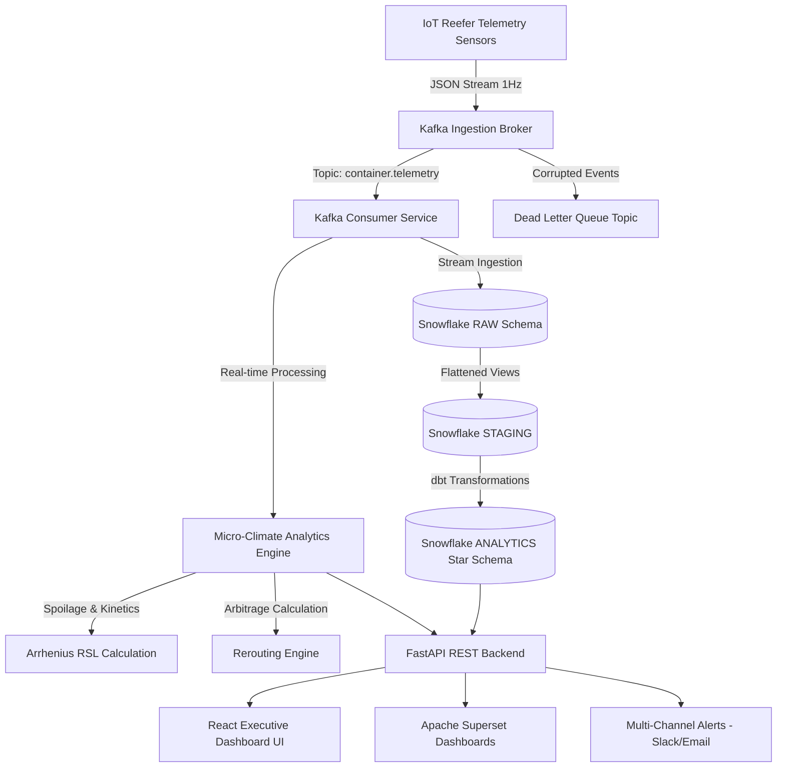
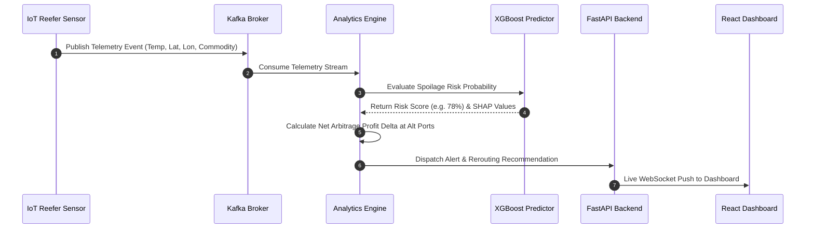
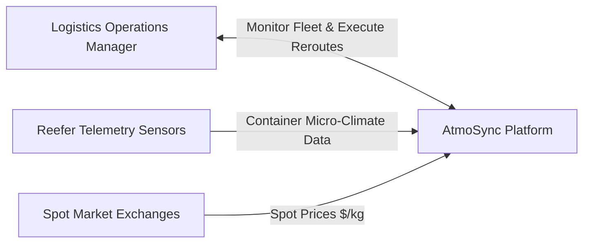

# AtmoSync System Architecture & Design Specification

## 1. System Architecture Overview

```mermaid
graph TD
    A[IoT Reefer Telemetry Sensors] -->|JSON Stream 1Hz| B[Kafka Ingestion Broker]
    B -->|Topic: container.telemetry| C[Kafka Consumer Service]
    B -->|Corrupted Events| DLQ[Dead Letter Queue Topic]
    
    C -->|Stream Ingestion| D[(Snowflake RAW Schema)]
    C -->|Real-time Processing| E[Micro-Climate Analytics Engine]
    
    E -->|Spoilage & Kinetics| F[Arrhenius RSL Calculation]
    E -->|Arbitrage Calculation| G[Rerouting Engine]
    
    D -->|Flattened Views| H[(Snowflake STAGING)]
    H -->|dbt Transformations| I[(Snowflake ANALYTICS Star Schema)]
    
    I --> J[FastAPI REST Backend]
    E --> J
    
    J --> K[React Executive Dashboard UI]
    J --> L[Apache Superset Dashboards]
    J --> M[Multi-Channel Alerts - Slack/Email]
```

## 2. Sequence Diagram: Telemetry to Rerouting Alert

```mermaid
sequenceDiagram
    autonumber
    participant Sensor as IoT Reefer Sensor
    participant Kafka as Kafka Broker
    participant Engine as Analytics Engine
    participant ML as XGBoost Predictor
    participant API as FastAPI Backend
    participant UI as React Dashboard

    Sensor->>Kafka: Publish Telemetry Event (Temp, Lat, Lon, Commodity)
    Kafka->>Engine: Consume Telemetry Stream
    Engine->>ML: Evaluate Spoilage Risk Probability
    ML-->>Engine: Return Risk Score (e.g. 78%) & SHAP Values
    Engine->>Engine: Calculate Net Arbitrage Profit Delta at Alt Ports
    Engine->>API: Dispatch Alert & Rerouting Recommendation
    API->>UI: Live WebSocket Push to Dashboard
```

## 3. Data Flow Diagram (DFD Level 0)

```mermaid
graph LR
    User[Logistics Operations Manager] <-->|Monitor Fleet & Execute Reroutes| Platform[AtmoSync Platform]
    Sensor[Reefer Telemetry Sensors] -->|Container Micro-Climate Data| Platform
    Market[Spot Market Exchanges] -->|Spot Prices $/kg| Platform
```
